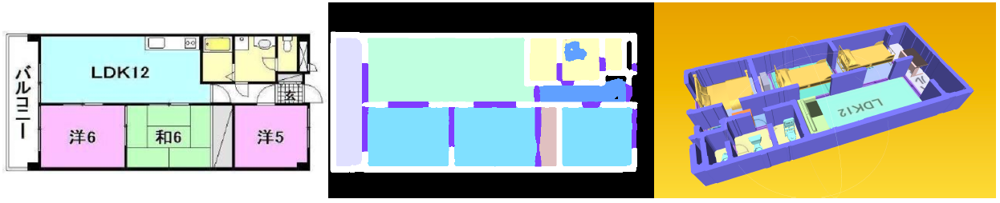
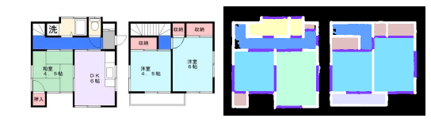
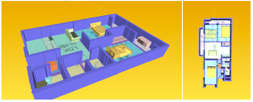

# DeepFloorPlan_Pytorch

This is a pytorch implementation for the floor plan segmentation on the r2v dataset.

As well as a simple 3D mesh modeling script with the ModelNet dataset.

## RESULTS
### Segmentation

| Method |      OverallAcc    |  Class Average | 
|--------|--------------------|----------------|
| PAPER CLAIMED  | 0.90       |         0.89   |
| HRNet          | 0.947      |         0.948  |
| HRNet + OCR    | 0.959      |         0.947  | 

### Mesh Reconstruction


if you need to train the model, 
you need to replace path in the bash script / config file to the your directory \
ModelNet Dataset and r2v/jp should be placed in the `./data`.
## TRAIN
```bash sourcecode/exp/02/train.sh```
## INFERENCE (TEST)
```bash sourcecode/exp/02/inference.sh```
## MESH RECONSTRUCTION
```bash sourcecode/exp/02/mesh.sh```
